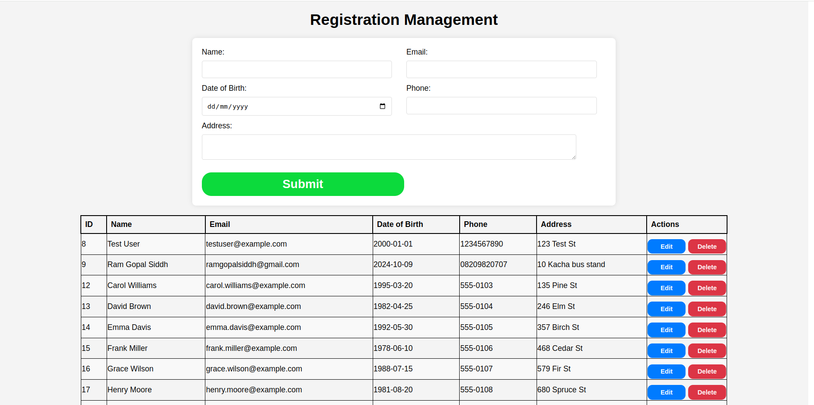
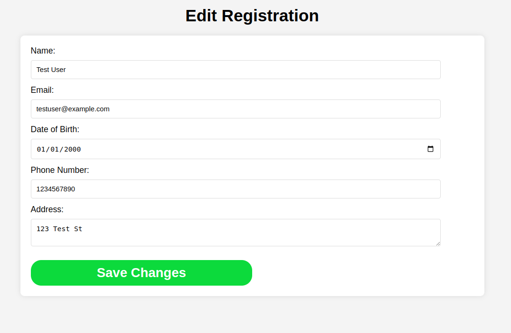
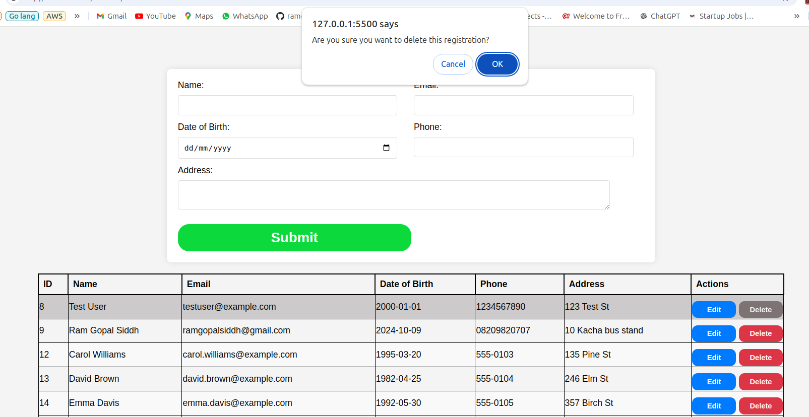

# Registration CRUD Web App

## Getting Started

# Backend

## Create a virtual environment
```
python -m venv env
```

## Activate the virtual environment
```
source env/bin/activate
```

## Clone the repository:
```
    git clone https://github.com/ramgopalsiddh/registration_crud

    cd registration_crud
```

## Prerequisites
```
 pip install -r requirements.txt
```

## Run API
```
uvicorn main:app --reload
```

## All routes 
 - ### Home 
 - http://127.0.0.1:8000

 - ### Register new user 
  - POST /register

  ### Get User by ID
  - GET /register/{id}

 - ### Get All Users
  - GET /registers

  - http://127.0.0.1:8000/registers

 - ### Update User by ID
  - PUT /register/{id}

  ### Delete User by ID
  - DELETE /register/{id}

# Frontend

 ### Go to frontend folder
    cd frontend/
 
 ### Run frontend 

```
python3 -m http.server 5500
```
#### Access frontend from 

- http://127.0.0.1:5500/index.html


### Screenshots 

 - ### Home page


 - ### edit user


 - ### Delete user



#### For more info OR suggestion contact me on

- ### My Twitter :- <a href="https://twitter.com/ramgopalsiddh1/"> Twitter/ramgopal </a>

- ### Linkedin :- <a href="https://www.linkedin.com/in/ramgopalsiddh/"> Linkedin/ramgopalsiddh </a>

- ### Portfolio :- <a href="https://ramgopal.dev/">ramgopal.dev</a>